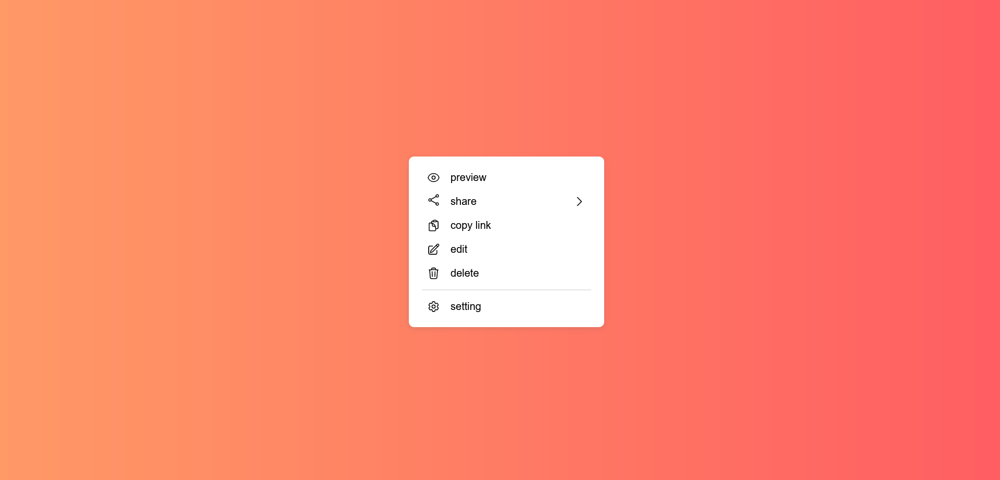

<h1 align="center">Custom Right Click</h1>

This is a JS mini project for practice.
In this mini project I learned how to make a custom context menu.

### Screenshot

### Built with

- Semantic HTML5 markup
- CSS custom properties
- Flexbox
- Mobile-first workflow
- pure javascript
